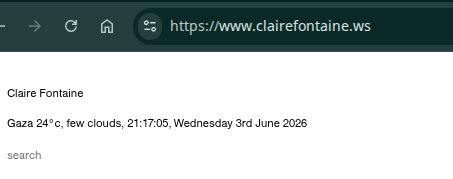

# Dateline — Global Conflict Hotspots Dashboard

A real-time dashboard displaying active conflict and crisis hotspots worldwide, built with React and Vite for GitHub Pages.

## Features

- **Live Data:** Hotspots sourced from the GDELT Project API (updated every 10 minutes)
- **Weather Integration:** Current temperature and conditions for each location via Open-Meteo API
- **Real-Time Local Time:** Clock displays local time in each hotspot's timezone
- **Category Filtering:** Filter by conflict type: armed conflict, humanitarian crisis, natural disasters, political repression, democracy crises, climate watch, and culture wars
- **Hide/Show Cards:** Personalize your view; preferences persist in browser storage
- **Zork 404 Page:** Play the classic 1980 text adventure game when you land on a 404
- **Region Filtering:** Filter by geographic region (North America, Europe, Asia, Africa, Latin America, Middle East, Oceania)

## Inspiration

**Dateline** is inspired by [Claire Fontaine](https://www.clairefontaine.ws), a minimalist site displaying a single location's real-time data—temperature, weather, and local time.



Dateline expands this concept into a **global dashboard**: instead of a single city, track 60+ crisis hotspots worldwide with live GDELT data, real-time local clocks, weather conditions, and dual filtering (category + region). The same monochrome aesthetic and focus on **real information, real time** carries through.

## Live Deployment

The dashboard is deployed to GitHub Pages:
- **URL:** `https://username.github.io/dateline/`
- **404 Page:** Play Zork I when you explore non-existent URLs

## Development

### Prerequisites
- Node.js 18+ (npm or yarn)

### Install Dependencies
```bash
npm install
```

### Run Locally
```bash
npm run dev
```
Open `http://localhost:5173` in your browser.

### Build for Production
```bash
npm run build
npm run preview  # preview the built site locally
```

## Deployment to GitHub Pages

1. **One-time setup:**
   - In your GitHub repo Settings → Pages
   - Set **Source** to "GitHub Actions"
   - (No other manual configuration needed)

2. **Deploy:**
   - Push changes to the `main` branch
   - GitHub Actions automatically builds and deploys to GitHub Pages
   - Visit `https://username.github.io/dateline/` to see the live site

The workflow (`.github/workflows/deploy.yml`) handles all CI/CD.

## Data Refresh

A GitHub Actions workflow runs every 4 hours to fetch fresh hotspot data from GDELT and commit updates to `public/locations.json`:

```
Schedule: 0 */4 * * *  (00:00, 04:00, 08:00, 12:00, 16:00, 20:00 UTC)
Trigger: Workflow dispatch (manual trigger from Actions tab)
Script: node scripts/refresh-locations.mjs
```

**Local testing:** Run the refresh script with staggered mode to avoid GDELT rate-limiting:
```bash
node scripts/refresh-locations.mjs --staggered
```

## Configuration

### Adding/Editing Hotspot Seed Data

The dashboard falls back to seed data in `public/locations.json` when GDELT is unavailable. Edit this file to customize:

```json
[
  {
    "id": "Gaza",
    "name": "Gaza",
    "country": "PS",
    "lat": 31.5,
    "lon": 34.47,
    "timezone": "Asia/Gaza",
    "headline": "...",
    "headlineUrl": "...",
    "seendate": "20260603T000000Z",
    "articleCount": 15,
    "categories": ["armed-conflict", "humanitarian"]
  },
  ...
]
```

### Crisis Categories

| ID | Label |
|----|-------|
| `armed-conflict` | Armed conflict / War |
| `humanitarian` | Humanitarian crisis |
| `natural-disaster` | Natural disaster |
| `political-repression` | Political repression |
| `democracy-crisis` | Crisis of democracy |
| `climate-watch` | Climate watch |
| `culture-wars` | Culture wars |

### Geographic Regions

| Region |
|--------|
| North America |
| Latin America |
| Europe |
| Middle East |
| Africa |
| Asia |
| Oceania |

## APIs & Attribution

**No authentication required.** All APIs are free and CORS-friendly.

- **[GDELT Project](https://www.gdeltproject.org/)** — Global events monitoring (1 request per 10 minutes per user)
- **[Open-Meteo](https://open-meteo.com/)** — Weather data (up to 10,000 requests/day per user)
- **[Zork I](https://opensource.microsoft.com/blog/2025/11/20/preserving-code-that-shaped-generations-zork-i-ii-and-iii-go-open-source/)** — © Infocom, Inc. Released under MIT License by Microsoft

## Project Structure

```
dateline/
├── .github/workflows/
│   ├── deploy.yml                   # CI/CD for GitHub Pages
│   └── refresh-data.yml             # Cron job to refresh hotspot data every 4 hours
├── scripts/
│   └── refresh-locations.mjs        # Node script to fetch & process GDELT data
├── public/                           # Static assets
│   ├── assets/
│   │   ├── zork/zork1.z3           # Z-machine story file (MIT licensed)
│   │   ├── zork/ZORK_LICENSE       # License file
│   │   ├── lib/zvm.min.js          # Z-machine interpreter (MIT licensed)
│   │   └── fonts/                  # Self-hosted font files
│   ├── locations.json              # Fallback seed data (61 hotspots)
│   └── 404.html                    # Zork easter egg
├── src/
│   ├── api/
│   │   ├── gdelt.js                # GDELT fetch & location extraction
│   │   ├── geocode.js              # City → coordinates lookup table
│   │   └── weather.js              # Open-Meteo API
│   ├── components/
│   │   ├── App.jsx
│   │   ├── FilterBar.jsx           # Category & region filters
│   │   ├── CardGrid.jsx
│   │   ├── ConflictCard.jsx
│   │   └── HiddenBanner.jsx
│   ├── hooks/
│   │   ├── useLocalStorage.js
│   │   ├── useGdelt.js
│   │   └── useClock.js
│   ├── utils/
│   │   ├── categories.js           # 7 crisis types
│   │   ├── regions.js              # 7 geographic regions
│   │   ├── flags.js
│   │   └── weatherCodes.js
│   ├── styles/
│   │   └── *.css
│   └── main.jsx
├── index.html
├── vite.config.js
├── package.json
└── README.md (this file)
```

## Design Aesthetic

The dashboard uses a monochrome industrial aesthetic inspired by **joy_division**:

- **Colors:** Near-black background (`#080808`), charcoal cards (`#0f0f0f`), light gray text (`#d4d4d4`)
- **Typography:** Inter (body) + Courier Prime (monospace) — self-hosted, no CDN
- **Borders:** Subtle industrial borders (`#222222`) with hover glow effect

## Browser Support

- Chrome / Chromium (latest)
- Firefox (latest)
- Safari (latest)
- Edge (latest)

Modern browser features used: ES2020+, CSS Grid, Fetch API, localStorage, Intl API.

## License

This project is released under the MIT License.

**Third-party licenses:**
- Zork I: MIT © Microsoft/Infocom
- ZVM interpreter: MIT © ifvms.js team
- React: MIT
- Vite: MIT

## Contributing

Contributions welcome! Open an issue or PR on GitHub.

## Troubleshooting

### Dashboard shows no cards
- Check browser console for errors
- Verify internet connection (APIs require network access)
- Wait a few seconds for GDELT to respond (can be slow)
- If persistent, refresh the page

### 404 page not loading Zork
- Ensure `zork1.z3` and `zvm.min.js` are in `public/assets/`
- Check the browser console for failed requests
- Try a fresh build: `npm run build`

### Weather not updating
- Open-Meteo may be rate-limited (unlikely at 48 requests/day)
- Check browser console for errors
- Refresh the page to retry

---

Built with [React](https://react.dev/), [Vite](https://vitejs.dev/), and [GDELT Project](https://www.gdeltproject.org/).

Zork 404 easter egg: Lost? Play a classic text adventure while you're here.
